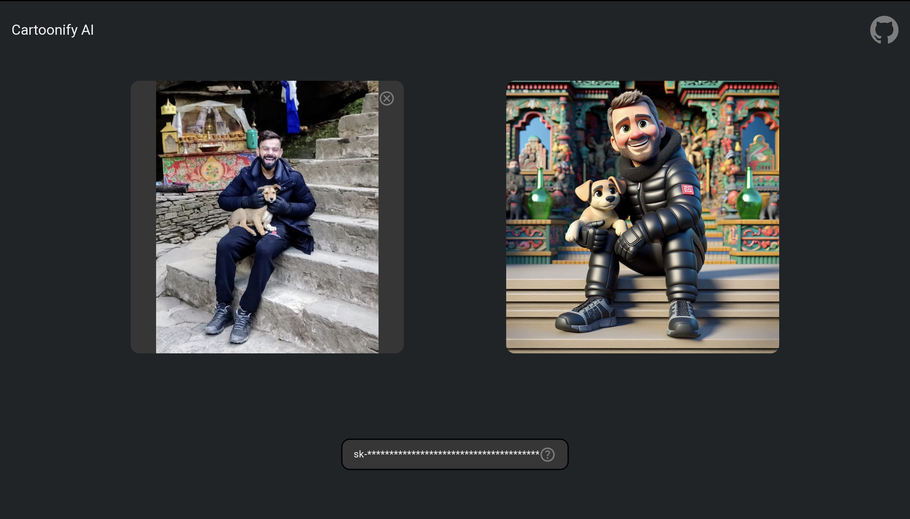
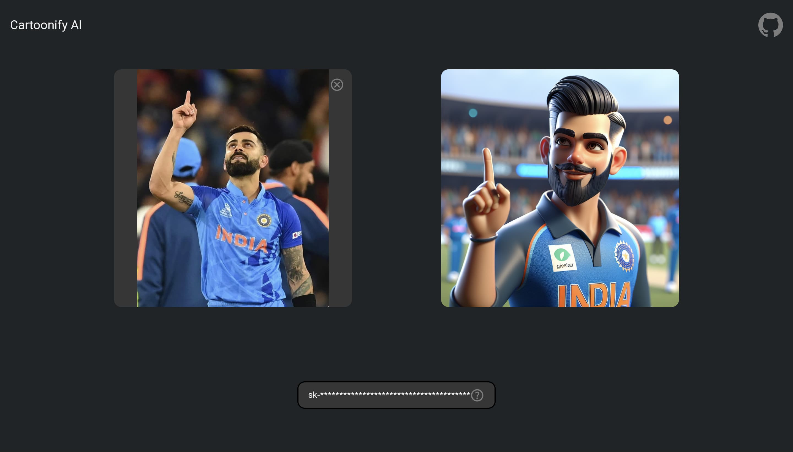
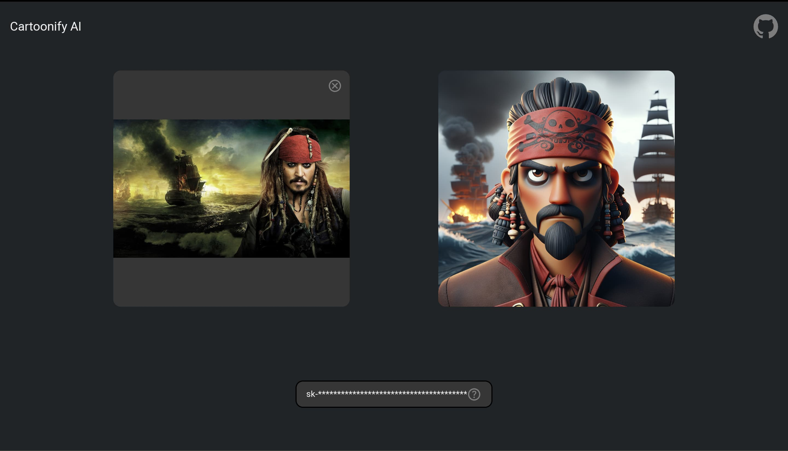
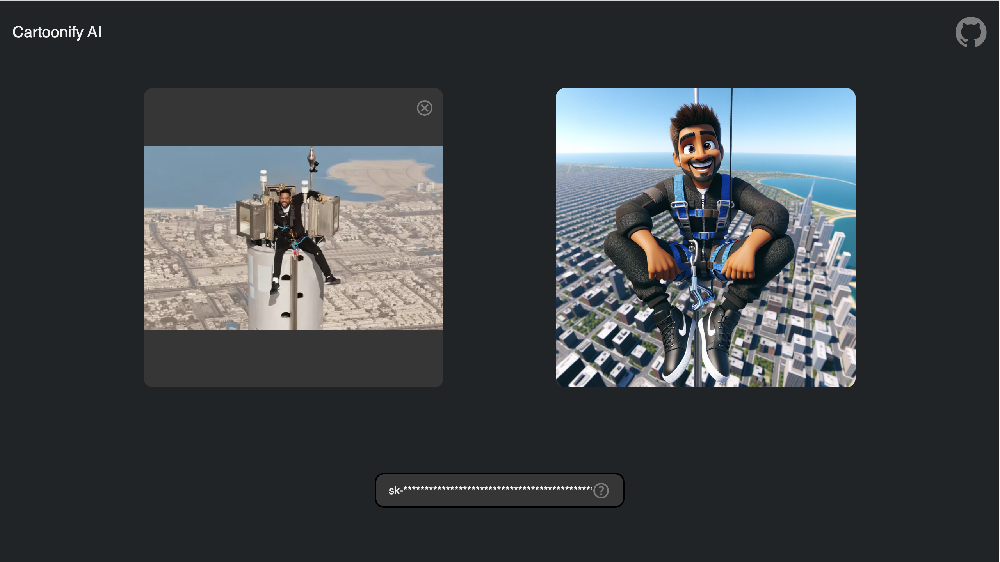
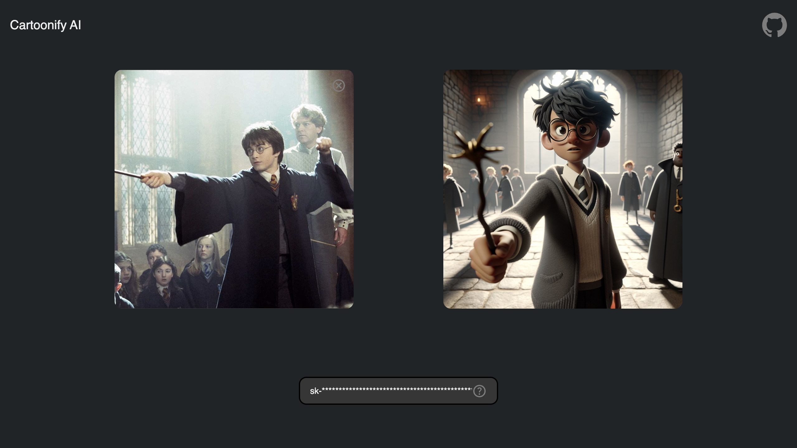
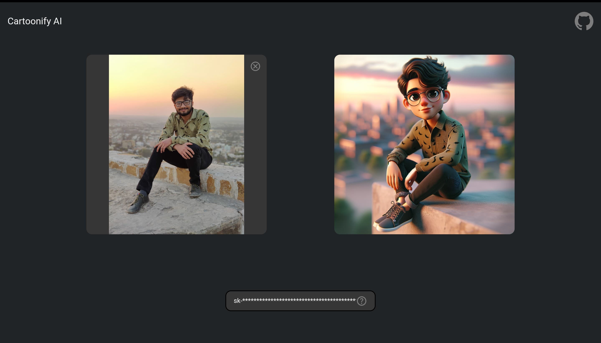

# Cartoonify AI

Using Cartoonify AI, you can generate cartoon version of an image.

## Live Demo

https://cartoonify-ai.pages.dev/

## Results








## Setup

Make sure to install the dependencies:

```bash
# pnpm
pnpm install
```

## Development Server

Start the development server on `http://localhost:3000`:

```bash
# pnpm
pnpm run dev
```

## Production

Build the application for production:

```bash
# pnpm
pnpm run generate
```
